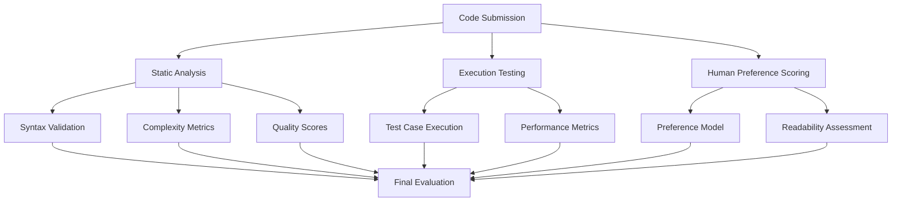

# RLHF-Based Code Evaluation Framework

A comprehensive evaluation framework for code generation quality that **doesn't rely on LLM-as-a-judge** approaches. Instead, it uses Reinforcement Learning from Human Feedback (RLHF) principles, static code analysis, execution-based testing, and human preference learning.

## Features

### 🚀 **Non-LLM Evaluation Methods**
- **Static Code Analysis**: Syntax validation, complexity metrics, code quality scores
- **Execution-Based Testing**: Safe code execution with test case validation
- **Human Preference Learning**: Reward models trained on human preferences
- **Performance Metrics**: Execution time, memory usage, efficiency scoring

### 📊 **Supported Datasets**
- **CrossCodeEval**: Cross-language code generation evaluation
- **RepoHyper**: Repository-level code understanding and generation
- **HumanEval**: Function-level code generation benchmark
- **Custom Datasets**: Easy integration of new evaluation datasets

### 🧪 **Evaluation Metrics**

#### Core Metrics (Non-LLM)
- **Correctness Score**: Based on test case pass rates
- **Execution Success**: Whether code runs without errors
- **Static Analysis**: Pylint scores, complexity, readability
- **Performance**: Execution time and efficiency

#### RLHF Metrics
- **Human Preference Score**: Learned from preference data
- **Maintainability Score**: Code structure and readability
- **Readability Score**: Comment ratio, naming conventions
- **Efficiency Score**: Runtime performance optimization

## Installation

```bash
cd eval_framework_RLHF
pip install -r requirements.txt
```

## Quick Start

```python
from app import RLHFEvaluationFramework, RLHFConfig

# Configure evaluation
config = RLHFConfig(
    datasets=["crosscodeeval", "humaneval"],
    output_dir="results",
    enable_execution=True,
    enable_static_analysis=True
)

# Initialize framework
framework = RLHFEvaluationFramework(config)

# Evaluate code submissions
submissions = {
    "problem_001": '''def fibonacci(n):
        if n <= 1:
            return n
        return fibonacci(n-1) + fibonacci(n-2)''',
    "problem_002": '''def reverse_string(s):
        return s[::-1]'''
}

# Run evaluation
results = framework.batch_evaluate(submissions)

# Generate reports and visualizations
framework.print_summary()
framework.create_rlhf_visualizations()
framework.export_results()
```

## Architecture

### 🏗️ **Framework Components**

1. **StaticAnalyzer**: Code quality and complexity analysis
2. **CodeExecutor**: Safe execution environment with test validation
3. **HumanPreferenceModel**: RLHF-based preference scoring
4. **DatasetLoader**: Support for multiple evaluation datasets

### 📈 **Evaluation Pipeline**



## Key Advantages Over LLM-as-a-Judge

### ✅ **Objective Evaluation**
- **Deterministic Results**: Same code always produces same scores
- **No LLM Bias**: Eliminates subjective LLM judgment inconsistencies
- **Measurable Metrics**: Concrete performance and quality indicators

### ⚡ **Performance Benefits**
- **Faster Evaluation**: No API calls to evaluation LLMs
- **Cost Effective**: No LLM inference costs for evaluation
- **Scalable**: Can evaluate thousands of submissions efficiently

### 🎯 **Comprehensive Assessment**
- **Multi-dimensional**: Correctness, performance, maintainability, preference
- **Real Execution**: Actual code execution with test validation
- **Human-Aligned**: Learned preferences from human feedback data

## Configuration Options

```python
@dataclass
class RLHFConfig:
    datasets: List[str] = None  # ["crosscodeeval", "repohyper", "humaneval"]
    output_dir: str = "rlhf_evaluation_results"
    timeout: int = 30  # Code execution timeout
    max_code_length: int = 2000
    enable_execution: bool = True
    enable_static_analysis: bool = True
    reward_model_path: Optional[str] = None  # Path to trained reward model
    preference_data_path: Optional[str] = None  # Human preference data
```

## Evaluation Metrics Explained

### 📊 **Static Analysis Metrics**
- **Pylint Score**: Code quality based on PEP 8 and best practices
- **Cyclomatic Complexity**: Code branching and decision complexity
- **Readability Score**: Based on comments, naming, structure
- **Lines of Code**: Code length and conciseness

### 🧪 **Execution Metrics**
- **Test Cases Passed**: Number of test cases successfully executed
- **Execution Success**: Whether code runs without runtime errors
- **Execution Time**: Performance measurement
- **Memory Usage**: Resource consumption (when available)

### 🎯 **RLHF Metrics**
- **Human Preference Score**: Learned from preference data
- **Maintainability Score**: Long-term code quality
- **Efficiency Score**: Performance optimization quality
- **Correctness Score**: Composite correctness assessment

## Dataset Integration

### Adding New Datasets

```python
class DatasetLoader:
    @staticmethod
    def load_custom_dataset() -> List[CodeTestCase]:
        return [
            CodeTestCase(
                problem_id="custom_001",
                problem_description="Your problem description",
                language="python",
                expected_behavior="Expected behavior description",
                test_cases=[
                    {"input": "test_input", "expected": "expected_output"}
                ],
                category="custom_category"
            )
        ]
```

## Visualization and Reporting

The framework generates comprehensive visualizations:

1. **Score Distribution**: Overall performance distribution
2. **Correctness vs Preference**: Correlation analysis
3. **Complexity vs Maintainability**: Code quality relationships
4. **Performance Radar**: Multi-dimensional assessment
5. **Category Analysis**: Performance by problem type
6. **Efficiency Analysis**: Code length vs execution time

## Example Output

```
======================================================================
RLHF CODE EVALUATION SUMMARY
======================================================================
📊 Total Problems Evaluated: 3
🔍 Syntax Valid: 3/3 (100.0%)
✅ Execution Success: 3/3 (100.0%)

📈 AVERAGE SCORES:
  Correctness: 1.000
  Human Preference: 0.742
  Readability: 0.856
  Maintainability: 0.823
  Efficiency: 0.891

🏆 TOP PERFORMING PROBLEMS:
  1. humaneval_001: 1.000 correctness, 0.750 preference
  2. crosscode_002: 1.000 correctness, 0.745 preference
  3. crosscode_001: 1.000 correctness, 0.731 preference
======================================================================
```

## Future Enhancements

- **Multi-language Support**: Extend beyond Python to Java, C++, JavaScript
- **Advanced Reward Models**: More sophisticated RLHF training
- **Real-time Evaluation**: Streaming evaluation for continuous integration
- **Custom Metrics**: User-defined evaluation criteria
- **Distributed Execution**: Scale evaluation across multiple machines

## Contributing

1. Fork the repository
2. Create your feature branch (`git checkout -b feature/amazing-feature`)
3. Commit your changes (`git commit -m 'Add amazing feature'`)
4. Push to the branch (`git push origin feature/amazing-feature`)
5. Open a Pull Request

## License

This project is licensed under the MIT License - see the LICENSE file for details.